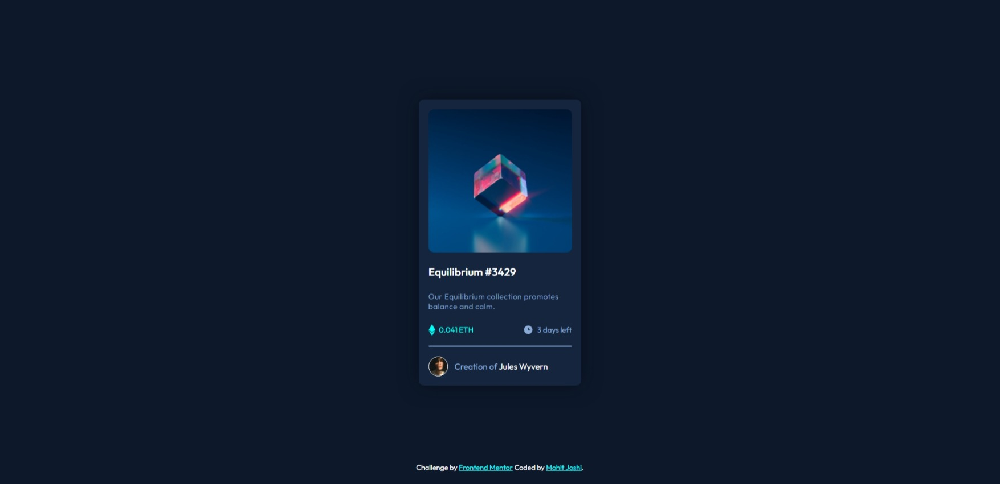
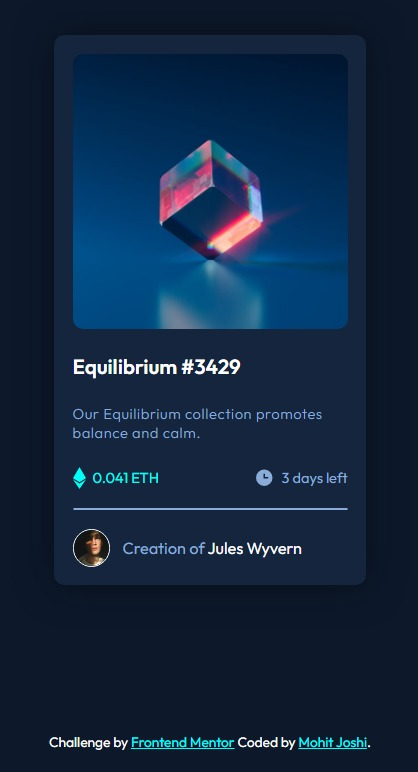

# Frontend Mentor - NFT preview card component solution

This is a solution to the [NFT preview card component challenge on Frontend Mentor](https://www.frontendmentor.io/challenges/nft-preview-card-component-SbdUL_w0U). Frontend Mentor challenges help you improve your coding skills by building realistic projects.

## Table of contents

- [Frontend Mentor - NFT preview card component solution](#frontend-mentor---nft-preview-card-component-solution)
  - [Table of contents](#table-of-contents)
    - [Screenshot](#screenshot)
    - [Links](#links)
    - [Built with](#built-with)
    - [What I learned](#what-i-learned)
    - [Author](#author)

### Screenshot




### Links

- Live Site URL: [QR Code Component Main](https://withmohitjoshi.github.io/FrontendMentor-Projects/nft-preview-card-component-main/)

### Built with

- Semantic HTML5 markup
- CSS custom properties
- Flexbox

### What I learned

```css
:root {
  --fs-body: calc(15 / 16 * 1rem);
}
body {
  font-size: var(--fs-body);
}
```

### Author

- Frontend Mentor - [@withmohitjoshi](https://www.frontendmentor.io/profile/withmohitjoshi)
