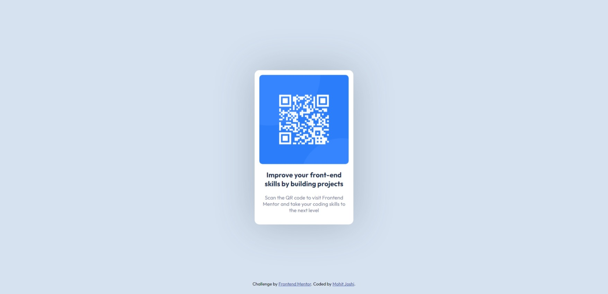

# Frontend Mentor - QR code component solution

This is a solution to the [QR code component challenge on Frontend Mentor](https://www.frontendmentor.io/challenges/qr-code-component-iux_sIO_H). Frontend Mentor challenges help you improve your coding skills by building realistic projects.

## Table of contents

- [Screenshot](#screenshot)
- [Links](#links)
- [Built with](#built-with)
- [What I learned](#what-i-learned)
- [Author](#author)

### Screenshot




### Links

- Live Site URL: [Add live site URL here](https://withmohitjoshi.github.io/FrontendMentor-Projects/qr-code-component-main/)

### Built with

- Semantic HTML5 markup
- CSS custom properties
- Flexbox

### What I learned

```css
:root {
  --fs-body: calc(15 / 16 * 1rem);
}
body {
  font-size: var(--fs-body);
}
```

### Author

- Frontend Mentor - [@yourusername](https://www.frontendmentor.io/profile/withmohitjoshi)
